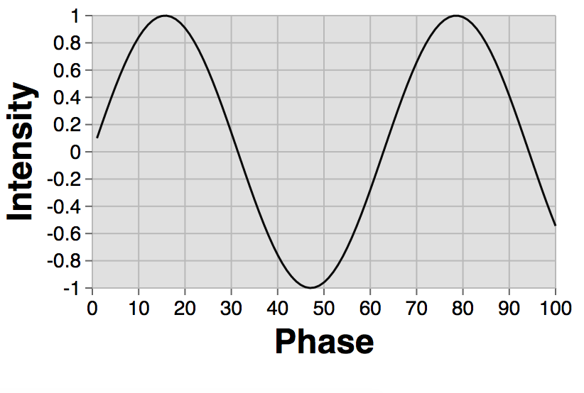

<p align="right">
  <a href="https://npmjs.org/package/reactochart">
    
  </a>
  <a href="https://travis-ci.org/spotify/reactochart">
    
  </a>
</p>

<h1 align="center">:chart_with_upwards_trend:  reactochart :chart_with_downwards_trend:</h1>

# Overview

Reactochart is a library of React components for creating data visualization charts and graphs. Components include **line chart**, **bar chart**, **area chart**, **heat maps**, **scatterplot**, **histogram**, **pie chart**, **sankey diagram**, and **tree map**.

# Getting started

1.  Install reactochart using npm.


```
npm i reactochart --save
```

2.  Then you can import an individual Reactochart component:


```
import LineChart from 'reactochart/LineChart'
```

3.  If you prefer, you can import all of Reactochart at once, though this may hinder some optimizations, such as webpack tree-shaking:


```
import {XYPlot, XAxis, YAxis, LineChart} from 'reactochart';
```

or

```
import * as Reactochart from 'reactochart';
```

4.  Import reactochart's base styles


```
import 'reactochart/styles.css'
```

5.  Build your first chart and see it rendered! For example, the following code snippet:


```
import XYPlot from 'reactochart/XYPlot';
import XAxis from 'reactochart/XAxis';
import YAxis from 'reactochart/YAxis';
import LineChart from 'reactochart/LineChart';
import 'reactochart/styles.css'

const MyFirstLineChart = (props) => (
  <XYPlot>
    <XAxis title="Phase" />
    <YAxis title="Intensity" />
    <LineChart
      data={Array(100).fill().map((e, i) => i+1)}
      x={d => d}
      y={d => Math.sin(d*.1)}
    />
  </XYPlot>
  )
```

should result in this:



# Live Examples

The examples contain more details about each component and the prop-types it accepts. To run the examples locally and play with the different types of charts in a live code editor:

1.  Clone this repo and `cd` to the newly-created directory
2.  Run `npm run serve` in your terminal (note: if you're running Python in v3 or higher you'll need to run `python -m http.server`)
3.  Go to [http://localhost:8000](http://localhost:8000)

# Reactochart Components

## Chart Foundations

### XY Plot

- [XYPlot](http://spotify.github.io/reactochart/docs/build/#/xy-plot)

### XY Axis Components

- [XAxis](http://spotify.github.io/reactochart/docs/build/#/x-axis), [YAxis](http://spotify.github.io/reactochart/docs/build/#/y-axis)
- [XAxisTitle](http://spotify.github.io/reactochart/docs/build/#/x-axis-title), [YAxisTitle](http://spotify.github.io/reactochart/docs/build/#/y-axis-title)
- [XAxisLabels](http://spotify.github.io/reactochart/docs/build/#/x-axis-labels), [YAxisLabels](http://spotify.github.io/reactochart/docs/build/#/y-axis-labels)
- [XTicks](http://spotify.github.io/reactochart/docs/build/#/x-ticks), [YTicks](http://spotify.github.io/reactochart/docs/build/#/y-ticks)
- [XGrid](http://spotify.github.io/reactochart/docs/build/#/x-grid), [YGrid](http://spotify.github.io/reactochart/docs/build/#/y-grid)

## Chart Types

### Non-XY charts

- [PieChart](http://spotify.github.io/reactochart/docs/build/#/pie-chart)
- [TreeMap](http://spotify.github.io/reactochart/docs/build/#/tree-map)
- [SankeyDiagram](http://spotify.github.io/reactochart/docs/build/#/sankey)

### XY charts

- [AreaBarChart](http://spotify.github.io/reactochart/docs/build/#/area-bar-chart)
- [AreaChart](http://spotify.github.io/reactochart/docs/build/#/area-chart)
- [AreaHeatmap](http://spotify.github.io/reactochart/docs/build/#/area-heatmap)
- [BarChart](http://spotify.github.io/reactochart/docs/build/#/bar-chart)
- [ColorHeatmap](http://spotify.github.io/reactochart/docs/build/#/color-heatmap)
- [FunnelChart](http://spotify.github.io/reactochart/docs/build/#/funnel-chart)
- [Histogram](http://spotify.github.io/reactochart/docs/build/#/histogram)
- [LineChart](http://spotify.github.io/reactochart/docs/build/#/line-chart)
- [MarkerLineChart](http://spotify.github.io/reactochart/docs/build/#/marker-line-chart)
- [RangeBarChart](http://spotify.github.io/reactochart/docs/build/#/range-bar-chart)
- [ScatterPlot](http://spotify.github.io/reactochart/docs/build/#/scatter-plot)

### XY datum components (used by charts/axes)

- [Bar](http://spotify.github.io/reactochart/docs/build/#/bar)
- [RangeRect](http://spotify.github.io/reactochart/docs/build/#/range-rect)
- [XLine](http://spotify.github.io/reactochart/docs/build/#/x-line), [YLine](http://spotify.github.io/reactochart/docs/build/#/y-line)

### Other

- [ZoomContainer](http://spotify.github.io/reactochart/docs/build/#/zoom-container)

# Development

If you'd like to contribute to the development this project, first fork & clone this repo, and then follow these steps:

### Global dependencies

- This project uses NPM to manage dependencies and run scripts. Run `npm -v` to check if you already have it installed.
  If you don't have it, NPM is packaged with Node.js - download and run the
  [install package located on nodejs.org](https://nodejs.org/) to install.
- Babel is used to transpile ES6+ code to ES5 syntax. Install by running `npm install --global babel`
- Webpack is used to bundle the JS & styles for the examples. Install by running `npm install --global webpack`

### Project dependencies

- Run `npm install` in the project root directory. This will install all of the project dependencies into the
  `node_modules` directory.

### Development process

- Run `npm run dev` to run the development server (webpack-dev-server), which will serve a live development version of
  the examples at [localhost:9876](http://localhost:9876)
- Make changes to the library code in the `src` directory, and/or changes to the examples in the `examples/src`
  directory.
- Once you are happy with your changes, run `npm run build` to generate a production build. (This transpiles the ES6
  library code, and transpiles + bundles the examples).
- `git commit` and `git push` your changes to your forked version of the repo.
- Open a Github pull request if you'd like to get your changes merged into the official repository.

### Notes

- **Do not make any changes in the `lib` or `examples/build` directories**, as these directories are destroyed and
  regenerated on each build.
- The development server uses [react-hot-loader](https://github.com/gaearon/react-hot-loader) to automatically
  "hot reload" changes to React components, so refreshing your web browser is usually not necessary. However, some
  changes will still require a refresh to propagate.

## Code of Conduct

This project adheres to the [Open Code of Conduct][code-of-conduct]. By participating, you are expected to honor this code.

[code-of-conduct]: https://github.com/spotify/code-of-conduct/blob/master/code-of-conduct.md
